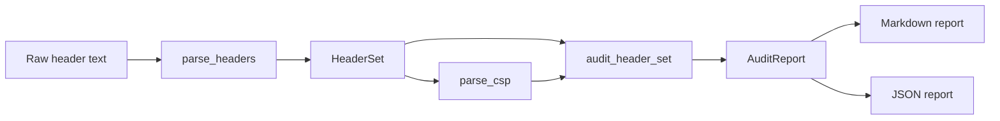

# 设计说明

## 项目定位

moonsec-headers 是一个纯 MoonBit 基础库，用于把原始 HTTP 响应头文本转换为结构化模型，并根据常见 Web 安全基线生成可解释审计报告。

项目不负责发起 HTTP 请求，也不扫描真实站点。调用者可以从任意来源提供响应头文本：测试 fixture、反向代理导出的 header、CI 中保存的快照、Wasm 应用的配置输出等。

## 数据流

## 核心模型

- `Header`：规范化后的 header 名、值和原始行号。
- `HeaderSet`：header 数组、按规范化名称索引的多值 Map、解析问题数组。
- `Directive`：CSP directive 名称和值数组。
- `CspPolicy`：CSP 原文、directive 列表、重复 directive 和解析问题。
- `Finding`：规则 ID、严重级别、关联 header、证据和修复建议。
- `AuditReport`：总分、等级、发现项和原始解析结果。

## 审计规则边界

当前规则集聚焦评审和工程实践中容易复现的响应头问题：

- CSP 缺失、`unsafe-inline`、`unsafe-eval`、script 通配源、HTTP script 源。
- CSP 缺失 `object-src 'none'`、`base-uri`、`frame-ancestors`。
- HSTS 缺失、`max-age` 缺失、`max-age` 过短、缺少 `includeSubDomains`。
- `X-Content-Type-Options` 缺失或非 `nosniff`。
- `X-Frame-Options` 缺失或非法值。
- `Referrer-Policy` 缺失、`unsafe-url`、旧默认值。
- `Permissions-Policy` 缺失或未限制 camera/microphone/geolocation。
- COOP/CORP 基础存在性和值检查。
- CORS 通配 origin 与 credentials 组合。

## 评分模型

初始分为 100，根据发现项严重程度扣分：

- Critical：30 分。
- High：20 分。
- Medium：10 分。
- Low：4 分。
- Info：0 分。

最低分为 0。等级：

- A：90 到 100。
- B：75 到 89。
- C：60 到 74。
- D：40 到 59。
- F：0 到 39。

## 可维护性

规则 ID 使用稳定字符串，例如 `csp.unsafe-inline-script`、`hsts.max-age-short`。后续新增规则时应保持已有 ID 不变，以便 CI 和下游工具用 `has_finding` 做回归断言。

后续可扩展方向：

- 增加 `Report-Only` CSP 的独立审计策略。
- 增加 `require-trusted-types-for`、`trusted-types` 等现代 CSP 规则。
- 增加 SARIF 或 JUnit XML 导出，便于接入更多 CI。
- 增加更细的风险配置文件，例如 static-site、api-only、admin-console。
